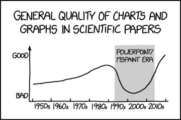

# Student Information

**Course:** COMP90054 AI Planning for Autonomy

**Semester:** Semester 2, 2024

**Student:**

your full name - your student number - your canvas student login

> [!IMPORTANT]
> Replace the lines above with your correct details. Your student number should only be the **numbers**. For example:
> Guang Hu - 000000 - ghu1.

**Collaborated With:**

> [!IMPORTANT]
> If you worked with another student, please include their **full name** and ask them to provide you with the **url to
their github codebase**. Their codebase should be private, you will not have access to the code, so there's no issue
> with knowing their URL, e.g. Collaborated with: Lionel Messi - URL: github.com/happy-with-the-worldcup-until-the-next-one.

# Self Evaluation

> [!NOTE]
> Do not exceed 500 words for each Part. This is indicative, no need to have 500 words, and it's not a strict limit.

## Part 1

#### Self Evaluated Marks (3 marks):

0

> [!IMPORTANT]
> Please replace the above 0 with the mark you think you earned for this part. Consider how many (yours/ours) tests
> pass, the quality of your code, what you learnt, and [mainly for the final task] the quality of the tests that you
> wrote

#### Code Performance 

This graph is just an example of how you can include your plots in markdown. **Please remove it in your final submission**

> [!TIP]
> Please explain the code performance of your solution. You can create a video, include figures, tables, etc. Make sure
> to complement them with text explaining the performance

#### Learning and Challenges
> [!TIP]
> Please include your top lessons learnt, and challenges faced. The questions below can help you structure your reflection.
> - How did you make decisions about which heuristics to use in these scenarios?
> - Reflect on any instances where your initial heuristic choices needed adjustment and how you approached those modifications.
> - Were there cases where the chosen heuristics led to suboptimal solutions? How did you recognize and address these situations?
> - Reflect on the trade-offs and considerations in selecting heuristics and their impact on the quality of your solutions.
> - What thing that you've learned are you most excited about? What challenges have you encountered?

#### Ideas That Almost Worked Well
> [!TIP]
> If you tried ideas that did not make it to the final code, please include them here and explain why they didn't make it.

#### Comparison with sample solution
> [!TIP]
> If you did not manage to pass all the tests, please compare your code with sample code and identify where you did wrong/differently, and what the appropriate way is to solve that issue. It will potentially gain you more marks even though you did not pass all the tests. 

#### New Tests Shared @ ED
> [!TIP]
> Tell us about your testcases and why were they useful

#### Justification
> [!TIP]
> Please state the reason why you have assigned yourself these marks.
> If you have assigned yourself with marks higher than the server feedback, you need to explain with more details, **including a detailed comparison between your solution and the sample solution**.

## Part 2

#### Self Evaluated Marks (4 marks):

0

> [!IMPORTANT]
> Please replace the above 0 with the mark you think you earned for this part. Consider how many (yours/ours) tests pass, the quality of your code, what you learnt, and [mainly for the final task] the quality of the tests that you wrote.

#### Code Performance
> [!TIP]
> - Which considerations did you make in terms of how recognising the goal state or generating successors can affect the performance of a search algorithm?
> - What is the main bottleneck to scale up this problem? What is it that makes this problem hard?

#### Learning and Challenges
> [!TIP]
> Please include your top lessons learnt, and challenges faced.

#### Ideas That Almost Worked Well
> [!TIP]
> If you tried ideas that did not make it to the final code, please include them here and explain why they didn't make
> it.

#### Comparison with sample solution
> [!TIP]
> If you did not manage to pass all the tests, please compare your code with sample code and identify where you did wrong/differently, and what the appropriate way is to solve that issue. It will potentially gain you more marks even though you did not pass all the tests. 

#### New Tests Shared @ ED
> [!TIP]
> Tell us about your testcases and why were they useful

#### Justification
> [!TIP]
> Please state the reason why you have assigned yourself these marks.
> If you have assigned yourself with marks higher than the server feedback, you need to explain with more details, **including a detailed comparison between your solution and the sample solution**.

